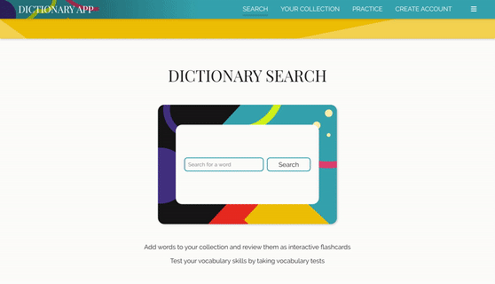
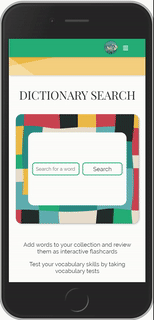
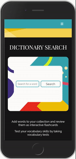

# Dictionary Application

This is dictionary search and vocabulary building application. It allows users to search for words' definitions, save words to their collections, review words as flashcards, add their own words to their collection, take dynamically generated tests, and more. 

This handy application has a simple and clean design and smooth UI for individuals looking to improve their vocabulary. The UX is enhanced with additional features such as light/dark mode and other theming options which allows users to customize the app to suit their personalities.  

Check out the deployed site [here](https://wandrew8.github.io/dictionaryApp/#/)!

## Tech Used
* React (Create-react-app cli)
* Styled Components
* Paaatterns for svg and color theming
* OwlBot API for supplying dictionary query data
* Wordnik API for "word of the day" data
* Moment.js for date formatting
* React-Router-Dom for routing 
* FontAwesome for icons
* Firebase Firestore for storing user and word collection data
* Firebase Authentication for third-party authentication
* React firebaseui for authentication components
* Prop Types
* React tooltips 
* GH-pages for deployment

## Design and UI/UX flow
Here are some screenshots of the application in action. The user can select between light and dark mode as well as various color and image theming options. All options are saved to the users' local storage so there's no need to reset options between use. The application is mobile responsive easy to navigate and use at any screen size.

## Contact
If you have any questions, comments or suggestions, please contact me at wandrew8@gmail.com. Check out more of my work [here](http://www.andrewjohnweiss.com).